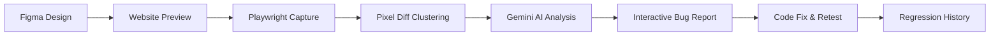

# DesignCheck AI

> **"Automatically validate your website against your Figma design."**  
> An enterprise-style automated visual QA platform connecting Figma designs to live websites through Playwright browser automation, mathematical pixel diffing, and Gemini AI root-cause analysis.

---

## 🌟 Executive Summary

DesignCheck AI solves a core frontend engineering challenge: **visual regression between Figma mockups and live code**. 

Instead of manual, error-prone visual inspection, DesignCheck AI:
1. Imports frames and generates reference images from Figma.
2. Serves your static website build or generates an AI website preview from a prompt.
3. Launches headless Chromium via Playwright to capture deterministic screenshots across viewports (Desktop 1440x900, Mobile 390x844).
4. Normalizes canvas dimensions and performs pixel-level comparison using `pixelmatch` and `sharp`.
5. Clusters difference pixels into spatial bounding boxes (`[ { x, y, width, height } ]`).
6. Leverages Google Gemini AI to analyze discrepancies and generate actionable bug reports with suggested CSS fixes.
7. Enables complete regression tracking and retesting workflows.



---

## 🛠️ Technology Stack

| Layer | Technologies |
| :--- | :--- |
| **Frontend** | React 19, Vite 8, JavaScript (ESM), Tailwind CSS v4, Lucide React, TanStack Query, Sonner, Recharts |
| **Backend** | Node.js (v22 LTS), Express.js, Mongoose, JWT (HttpOnly cookies), bcryptjs, Zod, Helmet, CORS |
| **Database** | MongoDB (Document Store with compound indexes) |
| **QA Automation** | Playwright (Headless Chromium), Sharp, Pixelmatch, PNGjs |
| **AI Engine** | Google Gemini API (`@google/genai` / `@google/generative-ai`) |
| **Security** | AES-256-GCM token encryption, SSRF protection, ZIP traversal prevention, 4-tier RBAC |
| **Testing** | Vitest, Supertest |

---

## 🚀 Quick Start & Local Setup

### Prerequisites
* **Node.js**: v20 or v22 LTS (`node -v`)
* **npm**: v10+ (`npm -v`)
* **MongoDB**: Connection URI (Local or MongoDB Atlas)

### 1. Clone & Install Dependencies

From root directory:
```bash
# Install Backend packages
cd Backend
npm install

# Install Frontend packages
cd ../Frontend
npm install
cd ..
```

### 2. Configure Environment Variables

Create `.env` in both `Backend/` and `Frontend/`:

#### `Backend/.env`
```env
NODE_ENV=development
PORT=5000
FRONTEND_URL=http://localhost:5173

MONGODB_URI=your_mongodb_connection_string
FIGMA_ENCRYPTION_KEY=your_encryption_key

# JWT Authentication
JWT_SECRET=your_jwt_secret_key_here
JWT_EXPIRES_IN=7d


# Google Gemini AI Key
GEMINI_API_KEY=your_gemini_api_key_here
GEMINI_MODEL=gemini-2.5-flash

# Storage & Previews
STORAGE_PROVIDER=local
STORAGE_LOCAL_PATH=./storage
PREVIEW_BASE_URL=http://localhost:5000

# Super Admin Seed Credentials
SUPER_ADMIN_NAME=Super Admin
SUPER_ADMIN_EMAIL=admin@designcheck.ai
SUPER_ADMIN_PASSWORD=AdminPass123!
```

#### `Frontend/.env`
```env
VITE_API_URL=http://localhost:5000/api
VITE_PREVIEW_URL=http://localhost:5000/preview
VITE_APP_NAME=DesignCheck AI
VITE_CANDIDATE_NAME=Priyanka Samiappan
VITE_GITHUB_URL=https://github.com/PriyankaSamiappan
VITE_LINKEDIN_URL=https://www.linkedin.com/in/priyanka-samiappan/
```

### 3. Seed Super Admin Account

Run the secure database seed script:
```bash
npm run seed:superadmin
```
*(Creates the Super Admin with all permissions assigned; credentials are never printed to logs).*

### 4. Start the Application

In two separate terminals:

**Terminal 1 (Backend Server & Test Worker):**
```bash
npm run dev:backend
# API running on http://localhost:5000
```

**Terminal 2 (Frontend Client):**
```bash
npm run dev:frontend
# Vite App running on http://localhost:5173
```

---

## 🧪 Testing

Execute unit and integration test suites:
```bash
npm test
```
*Tests cover:*
* SSRF URL validator and private IP range detection.
* AES-256-GCM token encryption and decryption.
* Figma file URL and key parsing.
* Visual comparison engine (match percentage, diff PNG, bounding box clustering).
* Complete end-to-end user workflow with mocked services.

---

## 👥 Main User Roles & Permission System

| Role | Scope |
| :--- | :--- |
| `SUPER_ADMIN` | Unrestricted global access: user management, role governance, global analytics, audit logs. |
| `ADMIN_L2` | Senior QA: Granular permissions assigned by Super Admin. |
| `ADMIN_L3` | Junior QA: Granular permissions assigned by Super Admin. |
| `USER` | Normal developer/designer: Restricted strictly to their own projects and test runs. |

### Permissions Matrix
* `dashboard.view`, `analytics.view`, `audit_logs.view`
* `users.view`, `users.manage`
* `projects.view`, `projects.view_all`
* `tests.view`, `tests.view_all`, `tests.run`
* `bugs.view`, `bugs.manage`
* `admins.create_l2`, `admins.create_l3`, `admins.manage`

---

## 📖 Interview Demo Flow

1. Open `http://localhost:5173` and click **"Login as Normal User"** (or register a new user).
2. Click **"+ New Project"** and name it `"Fashion Store QA"`.
3. In the **Figma Design** tab, click **"Use Demo Figma File"** and click **Connect & Import** (or enter a live Figma PAT and file URL).
4. In the **Website Build** tab, either:
   * Click **AI Website Theme Generator** and click **Generate Safe Website Preview**, OR
   * Upload `Backend/tests/fixtures/sample_website.zip`.
5. Open the **Page Mapping** tab to confirm frames mapped to routes (`/`, `/products`).
6. In **Test & Results**, click **"Run Visual QA Test"**.
7. Observe the Playwright worker capturing screenshots, calculating diffs, and obtaining Gemini AI fix suggestions.
8. Click any red bounding box on the implementation screenshot to view the bug card and suggested CSS fix.
9. Click **"Mark as Resolved"** and rerun the test to demonstrate regression tracking!
10. Sign out and log in as **Super Admin** (`admin@designcheck.ai` / `AdminPass123!`) to inspect:
    * Global analytics charts
    * User management with deactivation controls
    * Granular Admin L2/L3 creation with permission checkboxes
    * Complete security audit logs.

---

## 📄 Documentation Links
* [System Architecture (`docs/ARCHITECTURE.md`)](file:///d:/UI_testing_project/docs/ARCHITECTURE.md)
* [Security & Threat Modeling (`docs/SECURITY.md`)](file:///d:/UI_testing_project/docs/SECURITY.md)
* [Technical Interview Q&A (`docs/INTERVIEW_NOTES.md`)](file:///d:/UI_testing_project/docs/INTERVIEW_NOTES.md)

---

## 👤 Candidate Details
* **Name**: Priyanka Samiappan
* **GitHub**: [github.com/PriyankaSamiappan](https://github.com/PriyankaSamiappan)
* **LinkedIn**: [linkedin.com/in/priyanka-samiappan/](https://www.linkedin.com/in/priyanka-samiappan/)
