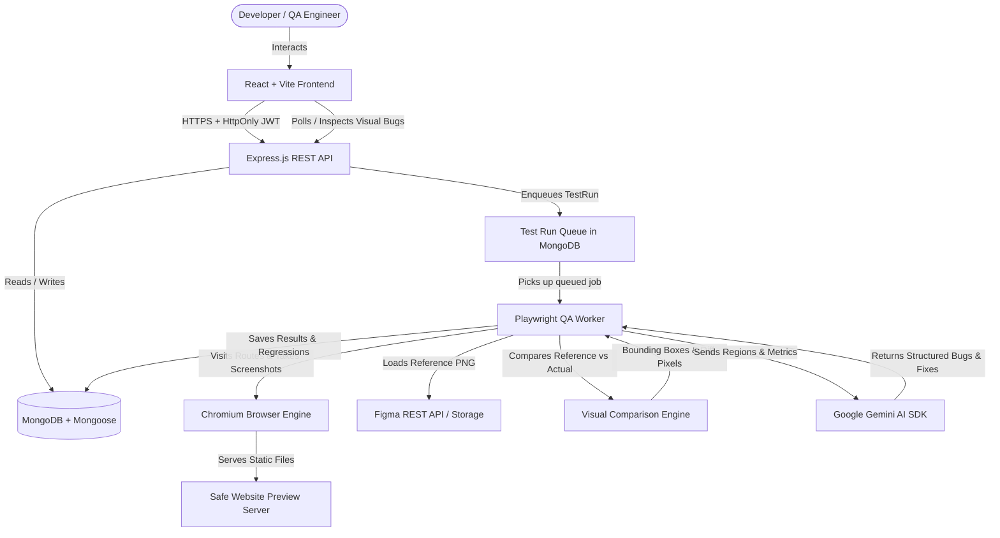

# DesignCheck AI — Architecture & Engineering Specification

## 1. System Overview

**DesignCheck AI** is an enterprise-grade automated visual QA platform designed to eliminate visual regressions by comparing implemented web applications directly against Figma design specifications.

---

## 2. Component Architecture

### A. Frontend Layer (`Frontend/src/`)
* **Core Framework**: React.js with Vite bundler (ESM native).
* **Styling**: Tailwind CSS with custom glassmorphism and developer-tool design system.
* **State Management**: TanStack React Query for asynchronous server state; React Context (`AuthContext`) for user session and role-based permissions.
* **Component Hierarchy**:
  * `components/layout/`: `Sidebar`, `Header`, `Footer` (with configurable candidate details).
  * `components/common/`: Reusable, accessible UI components (`Button`, `Card`, `Badge`, `Input`, `Modal`, `EmptyState`).
  * `components/testing/`: `DiffViewer` (4 view modes: Implementation, Reference, Diff Heatmap, Interactive Overlay Slider; interactive bounding box SVG overlay) and `BugModal` (structured AI issue breakdown).

### B. Backend Layer (`Backend/src/`)
* **Framework**: Node.js with Express.js following clean Controller $\rightarrow$ Service $\rightarrow$ Model separation.
* **Security Middleware**:
  * `helmet`: Secure HTTP headers with cross-origin resource policy enabled for image previews.
  * `cors`: Restricted origin validation with credentials support.
  * `express-rate-limit`: Stricter window limiters for authentication, Gemini AI endpoints, and test scheduling.
  * `authMiddleware`: Parses and verifies JWT from HttpOnly cookies and Bearer headers.
  * `permissionMiddleware`: Granular permission checks ensuring non-permitted requests return `403 FORBIDDEN`.
* **Storage Abstraction** (`StorageService`): Decoupled storage engine supporting local filesystem storage in development and S3/R2 object storage in production.
* **Encryption Utility** (`crypto.js`): AES-256-GCM authenticated encryption for storing Figma Personal Access Tokens.

### C. Visual Comparison Engine (`VisualComparisonService`)
1. **Dimension Normalization**: Uses `sharp` to normalize reference and implementation screenshots to matching canvas dimensions (e.g. 1440x900).
2. **Pixel-Level Comparison**: Computes differing pixels using `pixelmatch` while ignoring micro-antialiasing noise.
3. **Similarity Score Formula**:
   $$\text{Similarity Score} = \max\left(0, \min\left(100, \left(1 - \frac{\text{diffPixels}}{\text{totalPixels}}\right) \times 100\right)\right)$$
4. **Spatial Difference Region Clustering** (`diffClustering.js`):
   * Scans difference pixels onto a spatial grid.
   * Runs connected component expansion (BFS) to identify clusters of changed pixels.
   * Merges adjacent bounding boxes within a 24px proximity threshold.
   * Filters out tiny sub-pixel artifacts (<100 sq px).
   * Generates exact bounding coordinates: `[ { x, y, width, height, area, differencePercentage } ]`.

### D. Gemini AI Analysis (`GeminiService`)
* Uses official `@google/genai` and `@google/generative-ai` SDKs.
* **AI Website Theme Generation**: Converts user text prompts into a validated JSON schema containing predefined UI components (`navbar`, `hero`, `productGrid`, `newsletter`, `footer`).
* **Visual Bug Classification**: Analyzes observed difference coordinates, area, and page route to produce structured bug tickets distinguishing observed facts, likely causes, and suggested investigation areas.

---

## 3. Database Schema & Indexing Strategy

| Collection | Key Fields | Performance Indexes |
| :--- | :--- | :--- |
| **User** | `name`, `email`, `passwordHash`, `role`, `permissions`, `isActive`, `authProvider` | `{ email: 1 }` (unique), `{ role: 1 }`, `{ createdAt: -1 }` |
| **Project** | `name`, `description`, `createdBy`, `status`, `isDeleted` | `{ createdBy: 1, isDeleted: 1, createdAt: -1 }` |
| **FigmaConnection** | `projectId`, `fileKey`, `fileName`, `encryptedAccessToken` | `{ projectId: 1 }` (unique) |
| **PageMapping** | `projectId`, `figmaNodeId`, `figmaPageName`, `websiteRoute`, `viewportWidth`, `viewportHeight` | `{ projectId: 1, websiteRoute: 1 }` |
| **Website** | `projectId`, `type`, `previewId`, `previewUrl`, `themeConfig` | `{ projectId: 1 }`, `{ previewId: 1 }` (unique) |
| **TestRun** | `projectId`, `startedBy`, `status`, `overallScore`, `totalPages`, `durationMs` | `{ projectId: 1, createdAt: -1 }`, `{ status: 1, createdAt: 1 }` |
| **PageResult** | `testRunId`, `pageMappingId`, `matchPercentage`, `differenceRegions` | `{ testRunId: 1 }` |
| **Bug** | `projectId`, `pageResultId`, `title`, `severity`, `category`, `status`, `x`, `y`, `width`, `height` | `{ projectId: 1, status: 1 }`, `{ pageResultId: 1 }` |
| **AuditLog** | `actorUserId`, `action`, `resourceType`, `resourceId`, `ipAddress` | `{ actorUserId: 1, createdAt: -1 }`, `{ createdAt: -1 }` |
